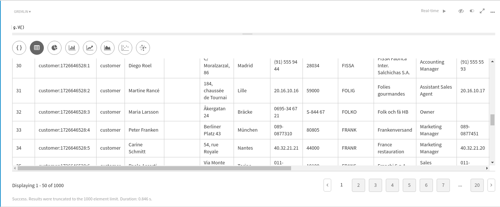
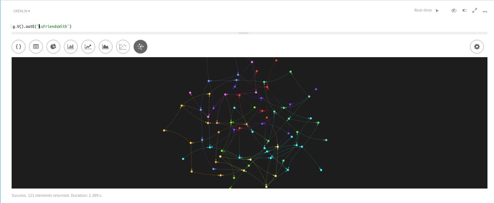
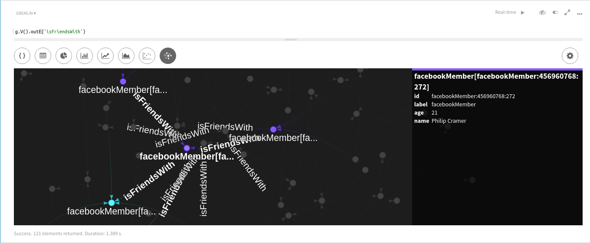
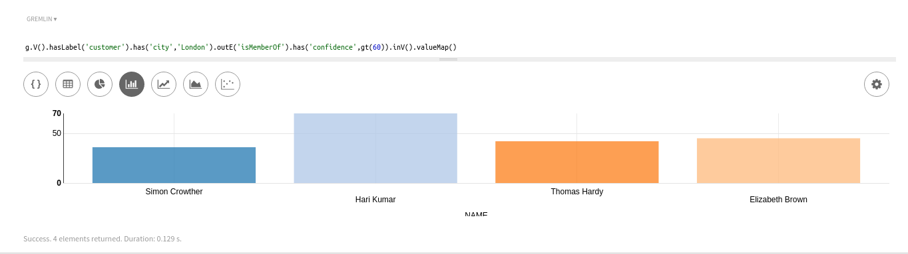
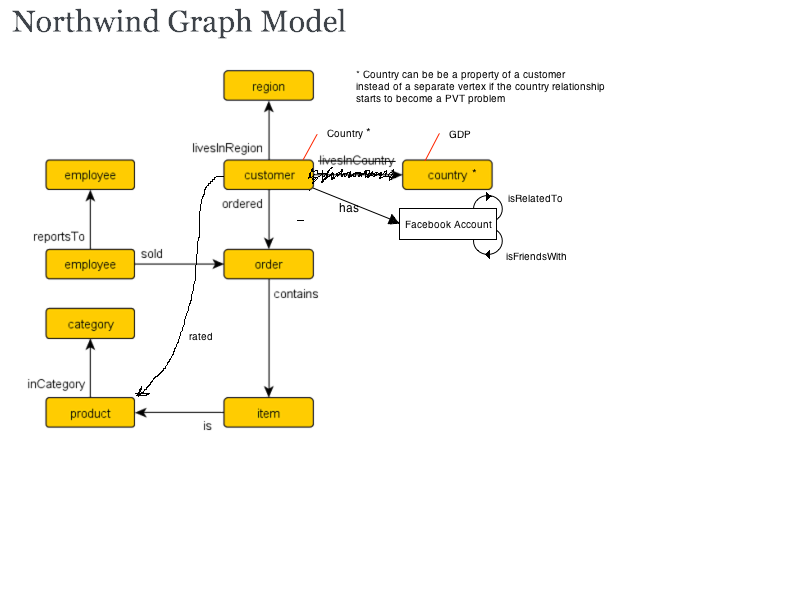

# dse-graph-NorthWind-database

Learn to use DataStax Enterprise (DSE) Graph:
- Load the Northwind database into DSE Graph
- Explore the data in DSE Studio using the Gremlin graph traversal language
- Modify the graph database schema and load additional data.

#Pre-requisites

##Training
Ideally you should first investigate the Gremlin language and the DataStax free training material at academy.datastax.com. 

In particular:
- Introduction to the DataStax platform - Data, Analystics, Search and Graph: https://academy.datastax.com/courses/
- For some wonderful Graph training from Tim Berglund: https://academy.datastax.com/resources/ds330-datastax-enterprise-graph


##Install or upgrade to DSE 5.0.5
You may as well get the latest DSE release - both DSE and Graph are improving all the time with new features and improved performance,

For the purpose of this exercise let's assume you're installing on a single node.
- Install Java 8 and Python 2.7+
- Set up and install DataStax Enterprise with Spark and Solr enabled - this demo is based upon DSE 5.0.5 with Spark 1.6.2 and Scala 2.10, using the packaged install method:
 - Ubuntu/Debian - https://docs.datastax.com/en/datastax_enterprise/5.0/datastax_enterprise/install/installDEBdse.html
 - Red Hat/Fedora/CentOS/Oracle Linux - https://docs.datastax.com/en/datastax_enterprise/5.0/datastax_enterprise/install/installRHELdse.html
- Note down the IP's of the node you're installing on

To setup your environment, you'll also need the following resources:
- Python 2.7
- Java 8
- For Red Hat, CentOS and Fedora, install EPEL (Extra Packages for Enterprise Linux).

Your URL's will be: 
- Opscenter => http://[DSE_NODE_IP]:8888/opscenter/index.html
- Spark Master => http://[DSE_NODE_IP]:7080/
- Solr admin page => http://[DSE_NODE_IP]:8983/solr/
- Node.js ReST interface => e.g. http://[DSE_NODE_IP]:3000
- Visual Dashboard => http://[DSE_NODE_IP]:8983/banana/#/dashboard
- DSE Studio => http://[DSE_NODE_IP]:9091
(where [DSE_NODE_IP] is the public IP address of your single node DSE installation)

>If you want the Graphloader and DSE Studio to be installed by the system use the package install for dse-demos

###Solr Documentation (Search):
https://docs.datastax.com/en/datastax_enterprise/5.0/datastax_enterprise/srch/searchOverview.html

###Spark Documentation (Analytics):
https://docs.datastax.com/en/datastax_enterprise/5.0/datastax_enterprise/ana/analyticsTOC.html

##Run DSE in Search Analytics mode

If you havent yet started DSE on this node you can skip to the section "Clone the RTFAP2 repository"

If you **have** already started the DSE service on this node, follow the instructions below to remove the default (Cassandra-only) database and start again in Search/Analytics/Graph mode:

1. Stop the service.
<pre>
$ sudo service dse stop
Stopping DSE daemon : dse                                  [  OK  ]
</pre>

2. Enable Solr, Spark and Graph

> You'll need about 8GB in your machine or VM to run the full suite.

Change the flag from "0" to "1" for Solr, Spark and Graph in /etc/default/dse:
<pre>
$ sudo vi /etc/default/dse
</pre>
e.g.:
<pre>
# Enable the DSE Graph service on this node
GRAPH_ENABLED=1
# Start the node in DSE Search mode
SOLR_ENABLED=1
# Start the node in Spark mode
SPARK_ENABLED=1
</pre>

3. Delete the default (Cassandra-only) datacentre databases:
<pre>
$ sudo rm -rf /var/lib/cassandra/data/*
$ sudo rm -rf /var/lib/cassandra/saved_caches/*
$ sudo rm -rf /var/lib/cassandra/commitlog/*
$ sudo rm -rf /var/lib/cassandra/hints/*
</pre>

4. Remove the old system.log:
<pre>
$ sudo rm /var/log/cassandra/system.log 
rm: remove regular file `/var/log/cassandra/system.log'? y
</pre>

5. Restart DSE
<pre>
$ sudo service dse start
</pre>
<br>

##Clone the dse-graph-NorthWind-database repository

Finally, clone this repo to a directory on the machine where you installed DSE:
```
$ git clone https://github.com/simonambridge/dse-graph-NorthWind-database
```


##Start DSE Studio

>Follow this section only if you didn't install the dse-demos package (you will already have Studio installed).

Use this URL for links to the documentation and download for DSE Studio: http://docs.datastax.com/en/latest-dse/datastax_enterprise/graph/QuickStartStudio.html?hl=studio

You can unzip the Studio download into a location of your choice.
For example:
```
tar -xzvf datastax-studio-1.0.2.tar.gz
sudo mv datastax-studio-1.0.2 /opt
cd /opt/datastax-studio-1.0.2/bin
nohup ./datastax-studio-1.0.2/bin/server.sh &
```
You'll find Studio running on port 9091

##Install DSE Graph Loader

>Follow this section only if you didn't install the dse-demos package (you will already have Graphloader installed).

Use this URL for links to the documentation and download for DSE Graphloader: http://docs.datastax.com/en/latest-dse/datastax_enterprise/graph/dgl/graphloaderTOC.html?hl=graphloader

You can unzip the Graphloader download into a location of your choice.
For example:
```
tar -xzvf dse-graph-loader-5.0.5.tar.gz
sudo mv dse-graph-loader-5.0.5 /opt
```
>You can now set an environment variable to point to this location in your graphloader commands, for example like this
```
LOADER_HOME=/opt/dse-graph-loader-5.0.5 export LOADER_HOME
$LOADER_HOME/graphloader ./northwind-map.groovy  -graph testGRYO -address localhost -dryrun false
```


#Get The Northwind data
There is some reference documentation on Kryo data imports here: http://docs.datastax.com/en/latest-dse/datastax_enterprise/graph/dgl/dglGRYO.html?hl=kryo

Download the Northwind database data file to your machine from: https://github.com/dkuppitz/sql2gremlin/blob/master/assets/northwind.kryo


#Create a DSE Graphloader mapping file

Graphloader needs a groovy file to tell it how to load the data.
Create northwind-mapping.groovy - you'll need to edit the inputpath to reflect your environment. Do not forget the trailing slash!:

```
$ pwd
/home/dse/dse_dev/dse-graph-Northwind-loader

$ vi northwind-map.groovy

//Configures the data loader to create the schema
config create_schema: true, load_new: true

def inputpath = '/home/dse/dse_dev/dse-graph-Northwind-loader/';
def inputfile = inputpath + 'northwind.kryo';

//Defines the data input source (a file which is specified via command line arguments)
source = Graph.file(inputfile).gryo()

//Specifies what data source to load using which mapper
load(source.vertices()).asVertices {
    labelField "~label"
    key "~id", "id"
}

load(source.edges()).asEdges {
    labelField "~label"
    outV "outV", {
        labelField "~label"
        key "~id", "id"
    }
    inV "inV", {
        labelField "~label"
        key "~id", "id"
    }
}
```
#Load The Northwind Data

##Pre-flights - re-run clean-up

>You'll need this to clean up if you're re-running this exercise

Delete an old graph you created (if there is one):

In the Gremlin console (```dse gremlin-console```) or in DSE Studio:
```
gremlin> :remote config alias g testGRYO.g
gremlin> schema.config().option('graph.schema_mode').set('Development')
gremlin> schema.clear()
```


##Load the Northwind data

Create a graph called testGRYO using the Graphloader.

>You can change -dryrun to false when ready to load (no data is loaded when you set it to true):

```
LOADER_HOME=/opt/dse-graph-loader-5.0.5 export LOADER_HOME

$ cd /home/dse/dse_dev/dse-graph-Northwind-loader

$LOADER_HOME/graphloader ./northwind-map.groovy  -graph testGRYO -address localhost -dryrun false
```
You should see this output:
```
2017-01-10 13:36:22 INFO  Reporter:92 - ADD Request for 0 vertices 4077 edges 0 properties 0 anonymous
2017-01-10 13:36:22 INFO  Reporter:97 - Current total additions: 3209 vertices 6177 edges 14554 properties 0 anonymous
2017-01-10 13:36:22 INFO  Reporter:99 - 23940 total elements written
```

#Create a new notebook in DSE Studio for your graph

Create a new notebook - call it Northwind, connect to the testGRYO graph database

Test its all in there:
```
g.V().count()
```
You should see 3209

You should be able to find every customer who lives in London
```
g.V().hasLabel('customer').has('city','London')
```

Have a play with the features. View the raw data:
<p align="left">
  
</p>
View it as a graph:
<p align="left">
  
</p>
Refine the search and zoom in:
<p align="left">
  
</p>
Trivial example but you get the idea:
<p align="left">
  
</p>

You can find more sample Gremlin reference queries for this data model here: http://sql2gremlin.com/

For example:
```
gremlin> g.V().hasLabel("category").values("name")
==>Beverages
==>Condiments
==>Confections
==>Dairy Products
==>Grains/Cereals
==>Meat/Poultry
==>Produce
==>Seafood
```

Also refer to https://github.com/dkuppitz/sql2gremlin


#Extend The Schema
- Our next objective is to extend the Northwind schema that we previously created and loaded data into. We'll define some new vertices and edges, and load some data into the database to populate those new elements. 
- The data that we will add is an entity describing a FacebookMember account with an edge relationship shared with the Customer entity, and a new edge between Customer and Product call "rated".
- We can also break the link between Customer and Country, replacing it with a new property on the Customer vertex called "country". This will prevent the Country vertex later becoming a potential "super vertex" (sometimes called the Justin Bieber problem). This happens where there are a great many edges connected to one vertex, and is not necessarily the most efficient way to store graph data.

<p align="left">
  
</p>
##Schema changes to support the new data
No actions here. This is for reference only - don't load these statements!!! - the groovy loader will do it with "create_schema: true".

These are the lines of Gremlin that you could run in the console to extend the schema manually. However we will let DSE Graph loader use our Groovy script to create the schema dynamically when it loads the data.

Reference only!!!
```
schema.propertyKey("age").Int().single().ifNotExists().create()
schema.propertyKey("confidence").Int().single().ifNotExists().create()
schema.propertyKey("relationshipType").Text().single().ifNotExists().create()
schema.propertyKey("affinityScore").Int().single().ifNotExists().create()
schema.propertyKey("rating").Int().single().ifNotExists().create()

schema.vertexLabel("facebookMember").properties("name", "age").ifNotExists().create()

schema.edgeLabel("isMemberOf").single().properties("confidence").connection("customer", "facebookMember").ifNotExists().create()
schema.edgeLabel("isRelatedTo").single().properties("relationshipType").connection("facebookMember", "facebookMember").ifNotExists().create()
schema.edgeLabel("isFriendsWith").single().properties("affinityScore").connection("facebookMember", "facebookMember").ifNotExists().create()
schema.edgeLabel("rated").single().properties("rating").connection("customer", "product").ifNotExists().create()

schema.vertexLabel('facebookMember').index('byName').materialized().by('name').ifNotExists().add()
```

##Check (or re-create) the csv files
These are a set of utility scripts to generate random data created by one of the DataStax Graph experts, Alice Lottini. 

You don't need to do anything here. There are already files generated that you can use now:
```
$ pwd
/home/dse/dse_dev/dse-graph-Northwind-loader/extend_schema/GeneratedDataAndScripts/GeneratedData
$ ls
facebookMembers.csv  identityEdges_c2fb.csv  isFriendsWith.csv  isRelatedTo.csv  rated.csv
```

##Create the Facebook identity and relationship data loader script
Now we need to create a new Groovy script for the loader for the new data.
We'll load it in two parts. The first part is mostly the data for the new FacebookMember vertex, FB reflexive edges and the rated edge.

You'll need to edit the inputpath to reflect your environment. Do not forget the trailing slash!

```
$ pwd
/home/dse/dse_dev/dse-graph-Northwind-loader/extend_schema/LoaderScripts

$ vi supplemental_fb_data_mapping.groovy

config create_schema: true, load_new: false

def inputpath = '/home/dse/dse_dev/dse-graph-Northwind-loader/extend_schema/GeneratedDataAndScripts/GeneratedData/';

fbMembersInput = File.csv(inputpath + 'facebookMembers.csv').delimiter('|')
identitiesInput = File.csv(inputpath + 'identityEdges_c2fb.csv').delimiter('|')
isFriendsWithInput = File.csv(inputpath + 'isFriendsWith.csv').delimiter('|')
isRelatedToInput = File.csv(inputpath + 'isRelatedTo.csv').delimiter('|')
ratedInput = File.csv(inputpath + 'rated.csv').delimiter('|')

//Specifies what data source to load using which mapper

load(fbMembersInput).asVertices {
    label "facebookMember"
    key "name"
}

load(isFriendsWithInput).asEdges {
    label "isFriendsWith"
    outV "nameFrom", {
        label "facebookMember"
        key "name"
    }
    inV "nameTo", {
        label "facebookMember"
        key "name"
    }
}

load(isRelatedToInput).asEdges {
    label "isRelatedTo"
    outV "nameFrom", {
        label "facebookMember"
        key "name"
    }
    inV "nameTo", {
        label "facebookMember"
        key "name"
    }
}

load(ratedInput).asEdges {
    label "rated"
    outV "customerName", {
        label "customer"
        key "name"
    }
    inV "productId", {
        label "product"
        key "id"
    }

}
```

##Load the Facebook identity and relationship data
Run the loader using the Groovy script we just created for the new data.

```
LOADER_HOME=/opt/dse-graph-loader-5.0.5 export LOADER_HOME

$ pwd
/home/dse/dse_dev/dse-graph-Northwind-loader/extend_schema/LoaderScripts

$ $LOADER_HOME/graphloader ./supplemental_fb_data_mapping.groovy -graph testGRYO -address localhost -dryrun false
```
You should see this output:
```
2017-01-10 14:15:09 INFO  Reporter:92 - ADD Request for 152 vertices 121 edges 85 properties 0 anonymous
2017-01-10 14:15:09 INFO  Reporter:97 - Current total additions: 237 vertices 121 edges 85 properties 0 anonymous
2017-01-10 14:15:09 INFO  Reporter:99 - 443 total elements written
2017-01-10 14:15:09 INFO  DataLoaderImpl:164 - Scheduling [rated] for reading
2017-01-10 14:15:10 INFO  Reporter:92 - ADD Request for 0 vertices 469 edges 0 properties 0 anonymous
2017-01-10 14:15:10 INFO  Reporter:97 - Current total additions: 237 vertices 590 edges 85 properties 0 anonymous
2017-01-10 14:15:10 INFO  Reporter:99 - 912 total elements written
```

##Create the Customer <-> Facebook edge data loader script
We now need another new Groovy script for the loader for the second part of the new data.
You'll need to edit the inputpath to reflect your environment. Do not forget the trailing slash!

```
$ pwd
/home/dse/dse_dev/dse-graph-Northwind-loader/extend_schema/LoaderScripts

$ vi supplemental_fb_edges_mapping.groovy

config create_schema: true, load_new: false

def inputpath = '/home/dse/dse_dev/dse-graph-Northwind-loader/extend_schema/GeneratedDataAndScripts/GeneratedData/';

def identities = inputpath + 'identityEdges_c2fb.csv';

isMemberOfInput = File.csv(identities).delimiter('|')

load(isMemberOfInput).asEdges {
    label "isMemberOf"
    outV "name", {
        label "customer"
        key "name"
    }
    inV "name", {
        label "facebookMember"
        key "name"
    }
}
```

##Load the Customer <-> Facebook edge data
Run the loader using the Groovy script we just created for the additional data.

```
LOADER_HOME=/opt/dse-graph-loader-5.0.5 export LOADER_HOME

$ pwd
/home/dse/dse_dev/dse-graph-Northwind-loader/extend_schema/LoaderScripts

$ $LOADER_HOME/graphloader ./supplemental_fb_edges_mapping.groovy -graph testGRYO -address localhost -dryrun false
```
You should see this output:
```
2017-01-10 14:25:43 INFO  Reporter:99 - 170 total elements written
2017-01-10 14:25:43 INFO  DataLoaderImpl:347 - Looking for relations in the following loads [identityEdges_c2fb]
2017-01-10 14:25:43 INFO  DataLoaderImpl:193 - Initializing tasks with [1] read threads and [1] loader threads
2017-01-10 14:25:43 INFO  DataLoaderImpl:164 - Scheduling [identityEdges_c2fb] for reading
2017-01-10 14:25:44 INFO  Reporter:92 - ADD Request for 0 vertices 85 edges 0 properties 0 anonymous
2017-01-10 14:25:44 INFO  Reporter:97 - Current total additions: 170 vertices 85 edges 0 properties 0 anonymous
2017-01-10 14:25:44 INFO  Reporter:99 - 255 total elements written
```

#Run some queries in Studio:
Now we have our data we can view it in Studio.

(if you need it)
```
schema.config().option('graph.schema_mode').set('Development')    
```
Everybody in London
```
g.V().hasLabel('customer').has('city','London')
```
Everybody in London with an associated Facebook ID with a confidence level greater than 60%
```
g.V().hasLabel('customer').has('city','London').outE('isMemberOf').has('confidence',gt(60)).inV().valueMap()
```
Everybody in London with an associated Facebook ID with a confidence level greater than 60% and show their combined details:
```
g.V().hasLabel('customer').has('city','London').as("customer").outE('isMemberOf').has('confidence',gt(60)).as("confidence").inV().as("friend")
    .select("customer", "confidence", "friend").by("name").by("confidence").by("name")
```
Another query - ordered group by:
```
gremlin> g.V().hasLabel("product").groupCount().by("unitPrice").order(local).by(keys, decr)

==>{263.5=1, 123.79=1, 97.0=1, 81.0=1, 62.5=1, 55.0=1, 53.0=1, 49.3=1, 46.0=1, 45.6=1, 43.9=2, 40.0=1, 39.0=1, 38.0=2, 36.0=1, 34.8=1, 34.0=1, 33.25=1, 32.8=1, 32.0=1, 31.23=1, 31.0=1, 30.0=1, 28.5=1, 26.0=1, 25.89=1, 25.0=1, 24.0=1, 23.25=1, 22.0=1, 21.5=1, 21.35=1, 21.05=1, 21.0=2, 20.0=1, 19.5=1, 19.45=1, 19.0=2, 18.4=1, 18.0=4, 17.45=1, 17.0=1, 16.25=1, 15.5=1, 15.0=2, 14.0=4, 13.25=1, 13.0=1, 12.75=1, 12.5=2, 12.0=1, 10.0=3, 9.65=1, 9.5=2, 9.2=1, 9.0=1, 7.75=1, 7.45=1, 7.0=1, 6.0=1, 4.5=1, 2.5=1}
```


